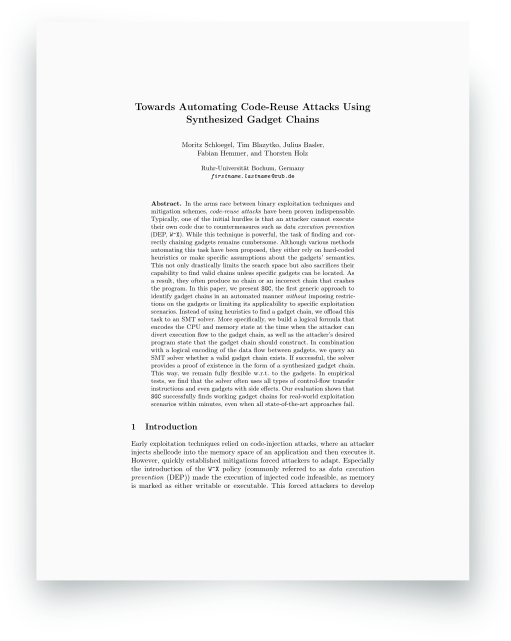

# SGC: Towards Automating Code-Reuse Attacks Using Synthesized Gadget Chains
<a href="https://www.syssec.ruhr-uni-bochum.de/media/emma/veroeffentlichungen/2021/08/16/GadgetSynthesis-ESORICS21.pdf">  </a>

SGC is a tool to automatically synthesize gadget chains. It builds a logical formula to encode execution state at the time when the attacker can divert execution flow to the gadget chain as well as the attacker’s desired program state that the gadget chain should construct. By extracting and then logically encoding gadgets, we query an SMT solver to decide whether a valid gadget chain exists.
Check out the [paper](https://www.syssec.ruhr-uni-bochum.de/media/emma/veroeffentlichungen/2021/08/16/GadgetSynthesis-ESORICS21.pdf) for details. 
```
@inproceedings{schloegel2021gadgetsynthesis,
    author = {Moritz Schloegel and Tim Blazytko and Julius Basler and Fabian Hemmer and Thorsten Holz},
    title = {Towards Automating Code-Reuse Attacks Using Synthesized Gadget Chains},
    year = {2021},
    booktitle =  {TODO},
}
```

Please note, SGC is *research code* and provided as-is. We intend to publish a polished successor geared towards practical day-to-day use (rather than academic evaluation) in the coming months, stay tuned!

# Features
What SGC can do - a non-exhaustive list:
* use gadgets with untypical instructions or side-effects
* build gadget chains
* prove no gadget chain can exist (sparing you further looking at the problem)
* model all complex constraints (that can be expressed as logic formula!)


# Installation
We strongly recommend to use the provided docker or at least a virtual environment. We install our customized Miasm (included as submodule) and this package to provide easy access to the APIs. To build:
```
git@github.com:RUB-SysSec/gadget_synthesis.git
cd synthesizer
git submodule init
git submodule update --init --recursive --rebase

# at this point, you may enter a virtual environment as described below

# build SMT solvers
cd lib/solvers
./install_solvers.sh all
cd -

python3 -m pip install --user -r requirements.txt
python3 -m pip install -e .
```


## Virtual Environment
Requires: `python3-venv`

First, create a virtual environment, then source it
```
python3 -m venv gs-env

source gs-env/bin/activate
```
Then, install the dependencies and synthesizer itself (optionally update pip/setuptools and install linters):
```
python3 -m pip install -U setuptools pip wheel mypy pylint
python3 -m pip install -r requirements.txt
python3 -m pip install -e .
```
## Docker
Alternatively to a virtual environment, we provide a Dockerfile and a few convenience/helper scripts.

### Build docker image
Run `./docker_build.sh` -- the image name is set in `docker_config.sh`.

### Run docker container
Run `./docker_run.sh` twice. First time, the docker container is started. If running `./docker_run.sh` while the container is running, you are connected (`/bin/zsh`). The bash and zsh history are saved (as is zshrc) in `docker_data`. For file sharing, this directory is available as volume within the container.
When launching the first time, you may need a few seconds until boolector is built or have to build it yourself (`install_solvers.sh` script). 

### Stop docker container
To stop (and delete) the container, run `./docker_stop.sh`.


# SGC's Workflow
The general workflow is to 
1. Manually identify a target and a desired state (and encode this information in a target configuration file -- for details, see [./targets/README.md](). 
2. Run SGC's `extractor.py` to automatically extract all functions from the target and disassemble all gadgets. These steps have to be conducted only once, the disassembly results are stored ("cached") in the targets directory to allow re-use. 
4. SGC's `synthesizer.py` can synthesize a gadget chain for the gadgets (or a subset of them). The synthesis process can use a multitude of different settings (different chain lengths, sizes of subsets, ...). The default settings can be found in `synthesizer_config_default.json`.
5. In an optional last step, you can verify the validity and applicability of the gadget chains using symbolic execution and/or GDB (refer to `verify_se.py` / `verify_gdb.py` in `./verification`).

# Example
To initiall extract all functions from the target and disassemble gadgets, first prepare a corresponding TargetConfig. In the following, we will use the target libc_wrapper and try to build a chain to `execve(&"/bin/sh", 0, 0)`.

```
# We want to use the execve config file and extract functions + gadgets
# * All relevant information will be cached in ./targets/libc_wrapper/.cache/
# * You can skip this step for libc_wrapper as the gadget addresses are included in this repository
# * Information such as logfiles are stored in /tmp/gadget_extractor
python3 extractor.py -c config_execve.json targets/libc_wrapper/

# We then want to synthesize a gadget chain -- run the synthesizer
# * To profit from multiple cores, use -j<NUMBER OF CORES>, but be aware that
#   using too many cores may lead to running out of RAM
# * Output and logfiles etc. are stored in /tmp/gadget_synthesizer
python3 synthesizer.py -c config_execve.json targets/libc_wrapper/ -j12

# To further verify the validity of the gadget chains (if any was found), run
# * `verify_se.py` to use symbolic execution
# * `verify_gdb.py` to use GDB to walk the chain
# * Using GDB may require you to disable ASLR: echo 0 | sudo tee /proc/sys/kernel/randomize_va_space
# * Assuming the configuration `iteration4-blocks0100-offset002-sw16` produced a chain (check for report.txt or stack.txt)
cd verification
python3 verify_gdb.py ../targets/libc_wrapper/config_execve.json /tmp/gadget_synthesis/libc_wrapper/iteration4-blocks0100-offset002-sw16/stack.txt tool libc_wrapper execve
python3 verify_se.py ../targets/libc_wrapper/config_execve.json /tmp/gadget_synthesis/libc_wrapper/iteration4-blocks0100-offset002-sw16/stack.txt tool libc_wrapper execve
cd -

```

# Synthesizer Configuration Parameters
The following values are used to configure the synthesizer:
```
all_iterations: List of all chain lengths to try + 1 (internally, the jump to the gadget chain is the first iteration, e.g. iteration 4 => chain will have lenght 3) 
solver: SMT solver to use -- must be supported by lib/smt_solvers
block_limits: Size of the sampled subset of gadgets 
restrict_mem: Whether to allow the solver to write only to specific memory areas (e.g., the solver does not know it cannot write/read from address 0 by itself)
disassemble_unaligned: Disassembly strategy (unaligned yields more gadgets for x86 but we haven't really fleshed it out - we recommend to set this to "false")
selection_strategy: How the sampled subset of gadgets should be chosen (pseudo-random with seed, pseudo-random, or deterministically)
selection_location: From which location the sampled subset of gadgets should be picked (main executable, libraries, or both)
control_flow_types: List of control flow types existing (e.g., "ret", "jmp", "call"). You can enforce only "ret"-based gadgets here for example
initial_seed: The seed to use (only for selection_strategy "seed")
initial_block_offset: The block offset (only for deterministic selection strategy)
max_selection_variations: How many different variations to try (initial + N variations)
all_max_stack_words: How many elements on the stack the solver may use at most (can be restricted by TargetConfig) 
solver_timeout: SMT solver timeout
disassembly_timeout: Initial disassembly timeout
```

# Contact

For more information, contact Moritz Schloegel ([@m_u00d8](https://twitter.com/m_u00d8)) or Tim Blazytko ([@mr_phrazer](https://twitter.com/mr_phrazer)).
